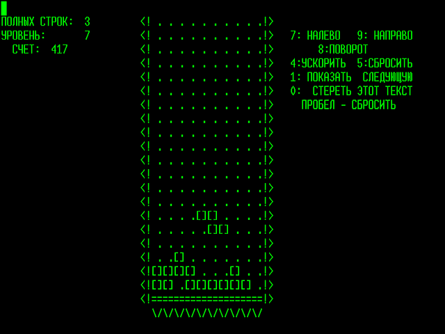
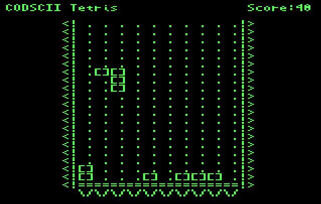

# CODSCII Tetris

Inspired by the original Tetris running on a russian homecomeputer. 

A Cody Basic Game for the [Cody Computer](https://www.codycomputer.org/).

# How to Play
Controls:
- W / Joystick Up : Fast Drop
- A / Joystick Left : Move Left
- D / Joystick Right : Move Right
- J / Fire : Rotate Clockwise
- K : Rotate Counterclockwise
- Space : Reset

# Screenshot

# Author

Lukas Lang

# Run (Emulation)
Run using  [Cody Computer Emulator](https://github.com/iTitus/cody_emulator):
`cargo run --release -- --fix-newlines codybasic.bin --uart1-source codsciitetris.bas --fast`

`LOAD 1,0` followed by `RUN` 

# Run (Real Hardware)

Run the program on the Cody computer using the Prop Plug. Use a terminal application such as RealTerm and insert delays so the Cody BASIC parser can keep up — for example, about 100 ms per line.

`LOAD 1,0` followed by `RUN` 

