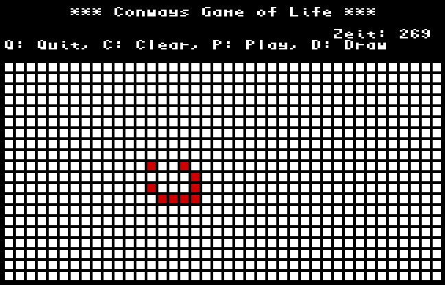

# Conways Game of Life

A Cody BASIC Game for the [Cody Computer](https://www.codycomputer.org/).

# How to Play
- Q: Quits the program
- C: Clears the entire field
- P: Switches to Animation Mode
- D: Switches to Draw Mode
- Arrow keys: Draw Mode only – move the cursor (green field)
- Space bar: Draw Mode only – mark a cell at the cursor position
- 1–2: Load sample examples

# Screenshot

# Run (Emulation)
Run using  [Cody Computer Emulator](https://github.com/iTitus/cody_emulator):
`cargo run --release -- --fix-newlines codybasic.bin --uart1-source conway.bas --fast`

`LOAD 1,0` followed by `RUN` 

# Run (Real Hardware)

Run the program on the Cody computer using the Prop Plug. Use a terminal application such as RealTerm and insert delays so the Cody BASIC parser can keep up — for example, about 100 ms per line.

`LOAD 1,0` followed by `RUN` 

