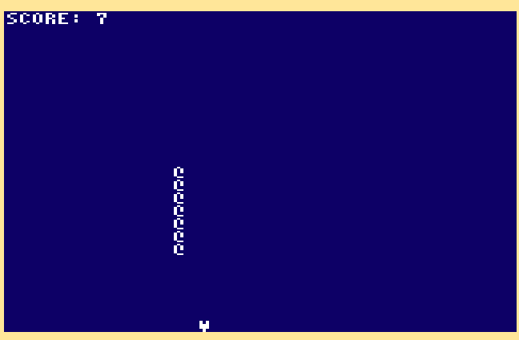

# Snake

The good old snake game implemented in Cody BASIC for the [Cody Computer](https://www.codycomputer.org/).

# How to Play
To control the snake use W A S D keys.

# Screenshot

# Run (Emulation)
Run using  [Cody Computer Emulator](https://github.com/iTitus/cody_emulator):
`cargo run --release -- --fix-newlines codybasic.bin --uart1-source snake.bas`

`LOAD 1,0` followed by `RUN` 

# Run (Real Hardware)

Run the program on the Cody computer using the Prop Plug. Use a terminal application such as RealTerm and insert delays so the Cody BASIC parser can keep up — for example, about 100 ms per line.

`LOAD 1,0` followed by `RUN` 

