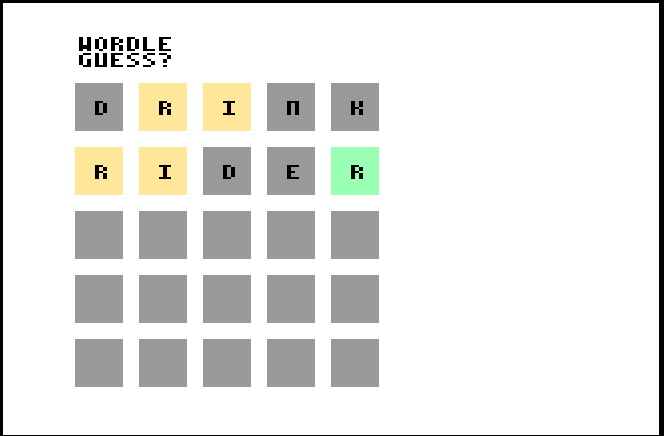

# Wordle

A Wordle clone written in Cody BASIC for the [Cody Computer](https://www.codycomputer.org/).

You have to guess a 5-letter word and have 5 attempts to do so.
Letters that are in the correct position are highlighted in green. Letters that are in the word but not in the correct position are highlighted in yellow. Letters that are not in the word remain gray.
Press the Cody button to start the game. This stops an internal timer, which is used to select a random word.

# How to Play
- Start: CODY Key
- Play: Enter Letters
- END: CODY Key

# Screenshot

# Author

Timo Mauerer

# Run (Emulation)
Run using  [Cody Computer Emulator](https://github.com/iTitus/cody_emulator):
`cargo run --release -- --fix-newlines codybasic.bin --uart1-source wordle.bas`

`LOAD 1,0` followed by `RUN` 

# Run (Real Hardware)

Run the program on the Cody computer using the Prop Plug. Use a terminal application such as RealTerm and insert delays so the Cody BASIC parser can keep up — for example, about 100 ms per line.

`LOAD 1,0` followed by `RUN` 
